# Lab Environment

**Download VMware Desktop Hypervisor** https://drive.google.com/drive/folders/1xPeOKfdeOzGdEHJRhYktJThgL6-xjkHy?usp=sharing  

**Download openEuler 22.03 LTS SP4** https://www.openeuler.org/en/download/?archive=true  

Table - **System Requirements**
| Component | Minimum Requirement |
|-----------|---------------------|
| Memory    | 4 GB                |
| Processor | 2 cores             |
| Storage   | 20 GB               |

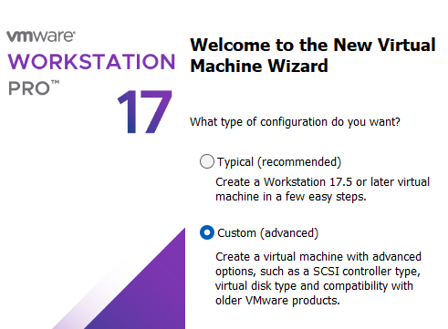  
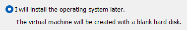  
  
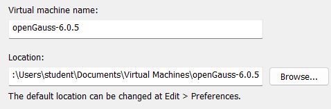  
  
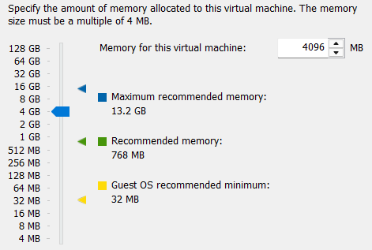  
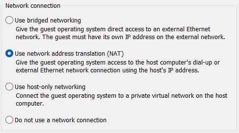  
  
  
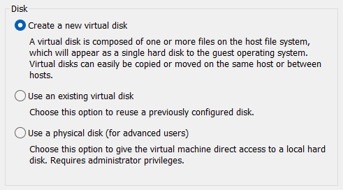  
  
  
  
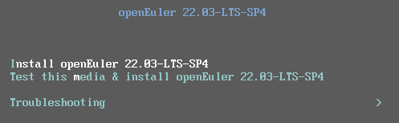  
  
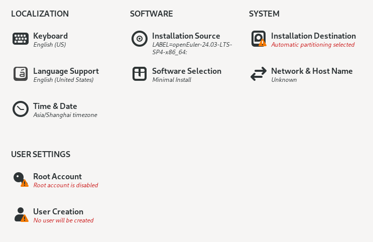  
  
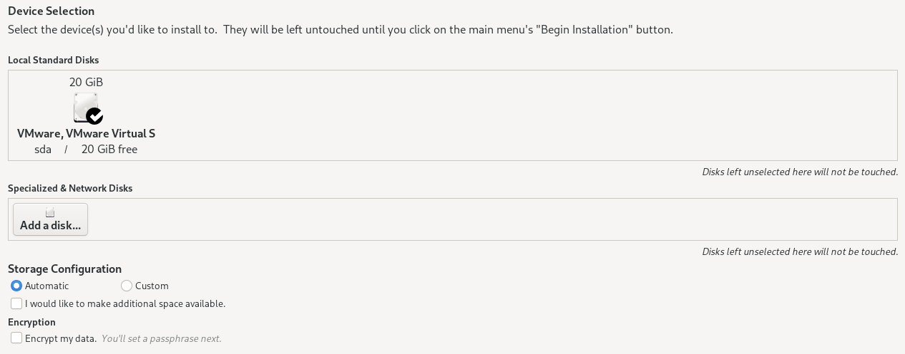  
  
  
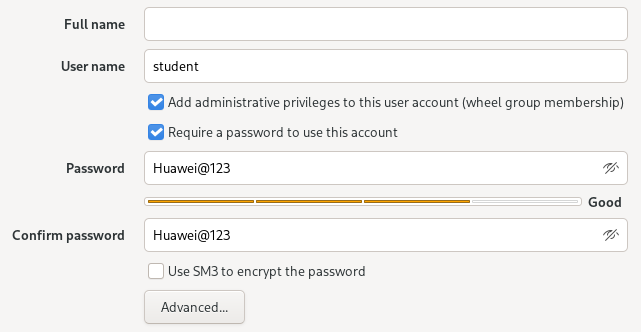  
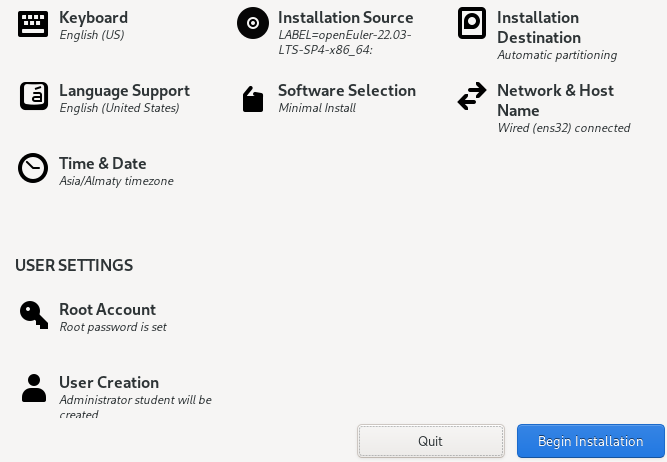  
  

**Shut Down Guest**  
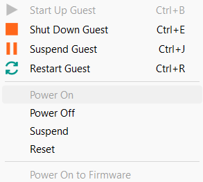  

**Hardware Device (RAM, CPU, Storage, NIC, Display)**  
  

login: **student**  
password: **123**  

```shell
student@openGauss~$ sudo passwd student
New password: 123

student@openGauss~$ sudo passwd root
New password: P@s$w0rd
```

```shell
student@openGauss~$ ping google.com -c2
```

```shell
student@openGauss~$ sudo dnf clean all
student@openGauss~$ sudo dnf makecache

student@openGauss~$ sudo dnf update -y
```

```shell
student@openGauss~$ sudo reboot
```

```shell
student@openGauss~$ sudo systemctl status sshd

student@openGauss~$ ip address
```

Configure Console Login Banner
```shell
student@openGauss~$ sudo vi /etc/issue
\S \l
Kernel \r

******************************************
Username: omm
Password: 123
******************************************
ENTER
ENTER

:wq
```
