# Lab Environment

**Download VMware Desktop Hypervisor** https://drive.google.com/drive/folders/1xPeOKfdeOzGdEHJRhYktJThgL6-xjkHy?usp=sharing  

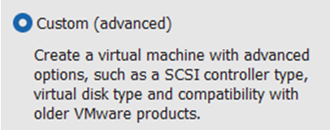  
  
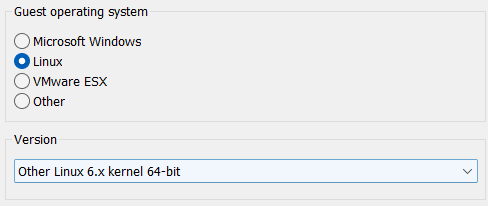  
  
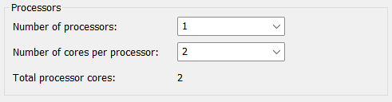  
  
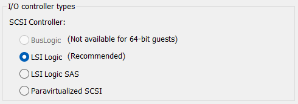  
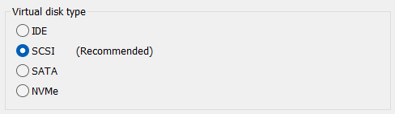  
  
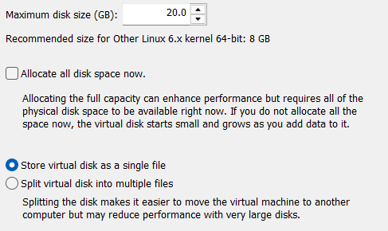  
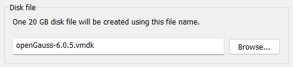  
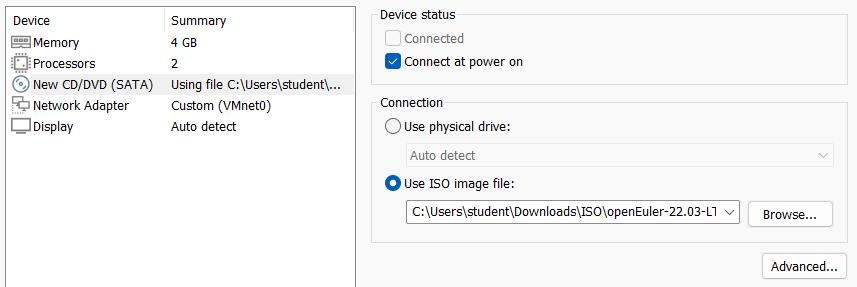  
  
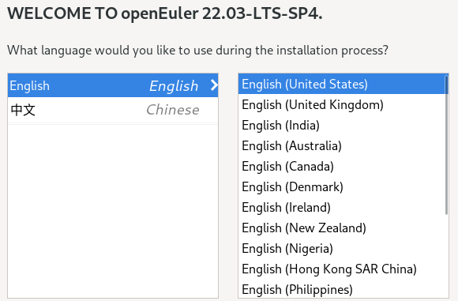  
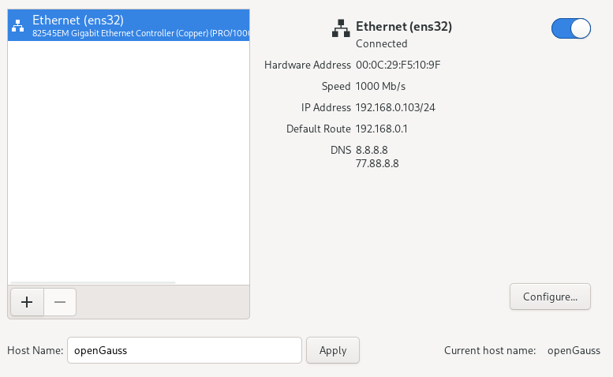  
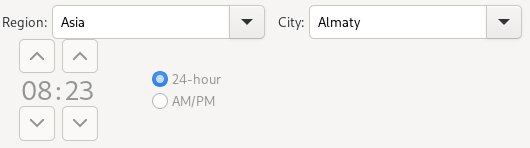  
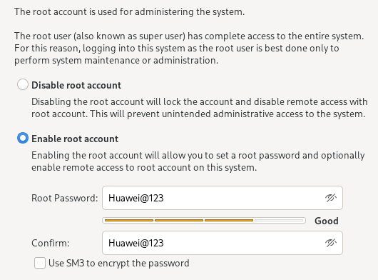  
  
  
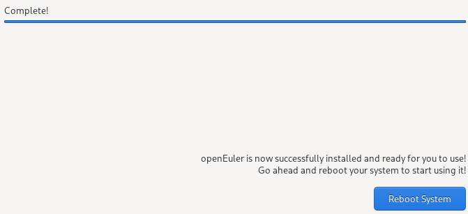  
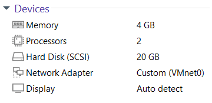  

login: **student**  
password: **123**  

```shell
student@openGauss~$ sudo passwd student
New password: 123

student@openGauss~$ sudo passwd root
New password: P@s$w0rd
```

```shell
student@openGauss~$ ping google.com -c2
```

```shell
student@openGauss~$ sudo dnf clean all
student@openGauss~$ sudo dnf makecache

student@openGauss~$ sudo dnf update -y
```

```shell
student@openGauss~$ sudo reboot
```

```shell
student@openGauss~$ sudo systemctl status sshd

student@openGauss~$ ip address
```

Configure Console Login Banner
```shell
student@openGauss~$ sudo vi /etc/issue
\S \l
Kernel \r

******************************************
Username: omm
Password: 123
******************************************
ENTER
ENTER

:wq
```

Clear Bash History
```shell
student@openGauss~$ history

student@openGauss~$ ls -la
student@openGauss~$ cat /dev/null > ~/.bash_history
student@openGauss~$ history -c
```
