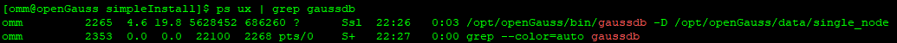
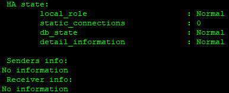

# Server-based installation on a Single Node

| item                  | value                           |
|-----------------------|---------------------------------|
| Operating System      | openEuler 22.03 LTS SP4 x86_64  |
| Hostname              | openGauss                       |
| Linux Database User   | omm                             |
| Linux Database Group  | dbgroup                         |
| openGauss Port Number | 5432/TCP                        |
| install Path          | /opt/openGauss                  |
| Data Path             | /opt/openGauss/data/single_node |


**Hostname**
```shell
student@openGauss~$ sudo vi /etc/hosts
Shift+} -> Edit mode -> Enter
192.168.0.103 openGauss
Normal mode -> :wq
```

```shell
student@openGauss~$ ping -c2 openGauss
64 bytes from openGauss (192.168.0.103): icmp_seq=1 ttl=64 time=0.035 ms
64 bytes from openGauss (192.168.0.103): icmp_seq=2 ttl=64 time=0.101 ms
```

**Configure openGauss User and Group**
```shell
student@openGauss~$ sudo groupadd dbgroup

student@openGauss~$ sudo useradd -g dbgroup omm

student@openGauss~$ sudo passwd omm
New Password: 123
```

```shell
student@openGauss~$ id omm
student@openGauss~$ getent passwd | grep omm
student@openGauss~$ getent group | grep dbgroup
```
  
```shell
student@openGauss~$ ss -tulpn | grep 5432

student@openGauss~$ netstat -tulpn | grep 5432
```

**DeCompress**
```shell
student@openGauss~$ ls -lh
openGauss-Server-6.0.5-openEuler22.03-x86_64.tar.bz2
```

```shell
student@openGauss~$ sudo mkdir /opt/openGauss

student@openGauss~$ sudo tar -xf openGauss-Server-6.0.5-openEuler22.03-x86_64.tar.bz2 -C /opt/openGauss

student@openGauss~$ ls -l /opt/openGauss/
drwxr-xr-x  root root   bin
drwxr-xr-x  root root   etc
drwxr-xr-x  root root   include
drwxr-xr-x  root root   lib
drwxr-xr-x  root root   share
drwxr-xr-x  root root   simpleInstall
-rw-r--r--  root root   version.cfg
```

**Permission**
```shell
student@openGauss~$ sudo chown -R omm:dbgroup /opt/openGauss
student@openGauss~$ sudo chmod -R 755 /opt/openGauss

student@openGauss~$ ls -l /opt
drwxr-xr-x  omm dbgroup openGauss
```

**install openGauss**
```shell
student@openGauss~$ su - omm
password: 123
omm@openGauss~$

omm@openGauss~$ cd /opt/openGauss/simpleInstall

omm@openGauss~$ sh install.sh -w "openGauss@123"
Would you like to create a demo database (yes/no)? yes
```
`-w` – мәліметтер қорына құпиясөз орнату  

```shell
omm@openGauss~$ source ~/.bashrc
-bash: ulimit: open files: cannot modify limit: Operation not permitted

omm@openGauss~$ vi ~/.bashrc
# ulimit -n 1000000
:wq

omm@openGauss~$ source ~/.bashrc
```
`source ~/.bashrc` – жаңадан қосылған айнымалыларды (мысалы: GAUSSHOME, gsql) жүйеге енгізеді  

**Verify Database**

> Database Directory: **/opt/openGauss/data/single_node**  

```shell
omm@openGauss~$ ps ux | grep gaussdb
/opt/openGauss/bin/gaussdb -D /opt/openGauss/data/single_node
```


```shell
omm@openGauss~$ gs_ctl query -D /opt/openGauss/data/single_node
Normal
```


**Connecting to openGauss**

```shell
omm@openGauss~$ gsql -d postgres
omm@openGauss~$ gsql -d postgres -r
SELECT version();
\q
```
`\copyright` – openGauss version  
`h` – help    
`\l` – дерекқорлардың тізімін көру  
`\c school` – school дерекқорына қосылу  
`\c finance` – finance дерекқорына қосылу  
`\dt` – кестелерді көрсету  
`\q` – шығу  

> Local Connection  
> gsql -d postgres -U omm -W "openGauss@123" -p 5432  

> Remote Connection  
> gsql -h 192.168.0.103 -d postgres -U omm -W "openGauss@123" -p 5432  

**Қосымша ақпарат!**

```shell
# Құпиясөзді өзгерту

ALTER ROLE omm IDENTIFIED BY 'new_password' REPLACE 'old_password';
```

```shell
# Error SEMMNI

student@openGauss~$ sysctl -w kernel.sem="250 85000 250 330"
немесе
student@openGauss~$ sudo vi /etc/sysctl.conf
kernel.sem="250 85000 250 330"
:wq
```

```shell
# import Demo Database

omm@openGauss~$ cd /opt/openGauss/simpleInstall
omm@openGauss~$ gsql -d postgres -U omm -W "openGauss@123" -f school.sql
omm@openGauss~$ gsql -d postgres -U omm -W "openGauss@123" -f finance.sql
```

```shell
# Configure Firewalld

student@openGauss~$ sudo systemctl enable --now firewalld
student@openGauss~$ sudo firewall-cmd --permanent --add-port=5432/tcp
student@openGauss~$ sudo firewall-cmd --reload

$ ss -tulpn | grep 5432
$ netstat -tulpn | grep 5432
```

```shell
omm@openGauss~$ echo $GAUSSHOME
/opt/openGauss
```

```shell
# openGauss status | start | stop | restart | reload

Status
gs_ctl query -D $GAUSSHOME/data/single_node

Stop
gs_ctl stop -D $GAUSSHOME/data/single_node -m fast

Start
gs_ctl start -D $GAUSSHOME/data/single_node -Z single_node

Restart
gs_ctl restart -D $GAUSSHOME/data/single_node -Z single_node

Reload
gs_ctl reload -D $GAUSSHOME/data/single_node
```

```shell
# pg_hba.conf файлдың ішіндегі "trust" мәнін "sha256" мәніне өзгертсек database-ге кірген кезде құпиясөзді сұрайтын болады!
# Негізінде бұл конфигурация міндетті емес!

omm@openGauss~$ cat $GAUSSHOME/data/single_node/pg_hba.conf

TYPE    DATABASE    USER    ADDRESS        METHOD
local   all         all                    trust
host    all         all     127.0.0.1/32   trust
host    all         all     ::1/128        trust

omm@openGauss~$ vi $GAUSSHOME/data/single_node/pg_hba.conf

TYPE    DATABASE    USER    ADDRESS        METHOD
local   all         all                    sha256
host    all         all     127.0.0.1/32   sha256
host    all         all     ::1/128        sha256

:wq

omm@openGauss~$ gs_ctl reload -D $GAUSSHOME/data/single_node
omm@openGauss~$ gs_ctl query -D $GAUSSHOME/data/single_node
```

```shell
omm@openGauss~$ gsql -d postgres -p 5432 -r
```

```shell
omm@openGauss~$ gsql -d postgres -U omm -W "openGauss@123"
omm@openGauss~$ gsql -d school -U omm -W "openGauss@123"
omm@openGauss~$ gsql -d finance -U omm -W "openGauss@123"
```

```shell
# Reboot and Shutdown

student@openGauss~$ sudo visudo
omm ALL=(ALL) NOPASSWD: /sbin/reboot, /sbin/shutdown
:wq

omm@openGauss~$ sudo reboot
omm@openGauss~$ sudo shutdown -h now
```

```shell
# SQL Commands

CREATE USER user1 IDENTIFIED BY 'User@123';
CREATE DATABASE db1 OWNER user1;

\c db1

CREATE TABLE students (
    id INT,
    name VARCHAR(50)
);

INSERT INTO students VALUES
(1, 'Berik'),
(2, 'Marat');

SELECT * FROM students;

\q

omm@openGauss~$ gsql -d db1 -U user1 -W "User@123"
```

```shell
# Auto Restart
# Create systemd Service

student@openGauss~$ sudo vi /etc/systemd/system/opengauss.service

[Unit]
Description=openGauss Single Node Database
After=network.target

[Service]
Type=forking
User=omm
Group=dbgroup
ExecStart=/bin/bash -lc 'source /home/omm/.bashrc; gs_ctl start -D /opt/openGauss/data/single_node'
ExecStop=/bin/bash -lc 'source /home/omm/.bashrc; gs_ctl stop -D /opt/openGauss/data/single_node -m fast'
ExecReload=/bin/bash -lc 'source /home/omm/.bashrc; gs_ctl restart -D /openGauss/data/single_node'
TimeoutSec=300

[Install]
WantedBy=multi-user.target

:wq

student@openGauss~$ sudo systemctl daemon-reload
student@openGauss~$ sudo systemctl enable opengauss

student@openGauss~$ su - omm -c 'source ~/.bashrc; gs_ctl stop -D /opt/openGauss/data/single_node -m fast'
server stopped

student@openGauss~$ sudo systemctl start opengauss
student@openGauss~$ sudo systemctl status opengauss --no-pager
```

**Clear Bash History**
```shell
student@openGauss~$ history

student@openGauss~$ ls -la
student@openGauss~$ cat /dev/null > ~/.bash_history
student@openGauss~$ history -c
```

**VMware Workstation -> Description**
```shell
Username: omm
Password: 123

Username: student
Password: 123

Username: root
Password: P@s$w0rd
```

**Take Snapshot**
```shell
Snapshot Manager -> Take Snapshot -> Name: initial image
```
