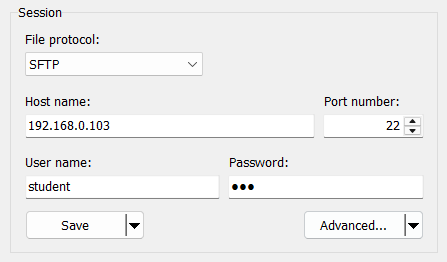
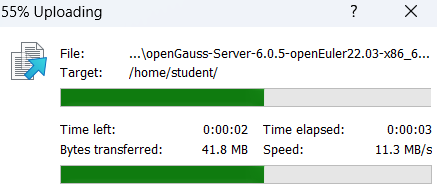

# Server-based installation on a Single Node

openGauss Default Username: omm
```shell
$ id omm
$ getent passwd | grep omm
$ getent group | grep dbgroup
```

openGauss Default Port Number: 5432/TCP  
```shell
$ ss -tulpn | grep 5432

$ netstat -tulpn | grep 5432
```

WinSCP Download Link: https://winscp.net/eng/download.php  

  
  

Create Directory
```shell
$ sudo mkdir /opt/openGauss
```

Decompress
```shell
$ sudo dnf install tar
$ sudo tar -xf openGauss-Server-6.0.5-openEuler22.03-x86_64.tar.bz2 -C /opt/openGauss

$ ls -l /opt/openGauss/
drwxr-xr-x  root root   bin
drwxr-xr-x  root root   etc
drwxr-xr-x  root root   include
drwxr-xr-x  root root   lib
drwxr-xr-x  root root   share
drwxr-xr-x  root root   simpleInstall
-rw-r--r--  root root   version.cfg
```

Permission
```shell
$ sudo chown -R omm:dbgroup /opt/openGauss
$ sudo chmod -R 755 /opt/openGauss

$ ls -l /opt
drwxr-xr-x  omm dbgroup openGauss
```

install openGauss
```shell
$ su - omm
password: 123
```

```shell
$ cd /opt/openGauss/simpleInstall

$ sh install.sh -w "Huawei@123"
Would you like to create a demo database (yes/no)? yes
```
`-w` – мәліметтер қорына құпиясөз орнату  

```shell
$ source ~/.bashrc
-bash: ulimit: open files: cannot modify limit: Operation not permitted

$ vi .bashrc
# ulimit -n 1000000
:wq

$ source ~/.bashrc
```
`source ~/.bashrc` – жаңадан қосылған айнымалыларды (мысалы: GAUSSHOME, gsql) жүйеге енгізеді  

> Database Name: sgnode  
> Database Directory: /opt/openGauss/data/single_node  

Verification
```shell
$ ps ux | grep gaussdb          // Database process-нің іске қосылғанын тексеру

Нәтиже:
/opt/openGauss/bin/gaussdb -D /opt/openGauss/data/single_node
```

```shell
$ gs_ctl query -D /opt/openGauss/data/single_node          // Database status-ын тексеру

Нәтиже:
local_role : Normal
static_connections : 0
db_state: Normal
detail_information: Normal
Senders info : No information
Receiver info : No information
```

```shell
$ gsql -d sgnode -U omm -W "Huawei@123" -p 5432
```
`\l` – дерекқорлардың тізімін көру  
`\c school` – school дерекқорына қосылу  
`\c finance` – finance дерекқорына қосылу  
`\dt` – кестелерді көрсету  


```shell
```

```shell
```
